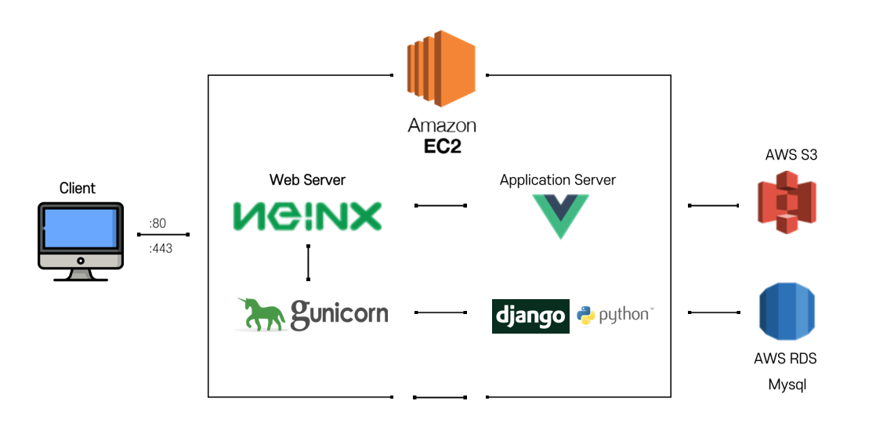
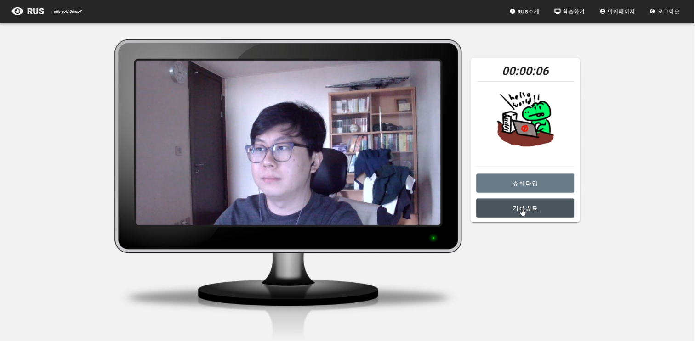
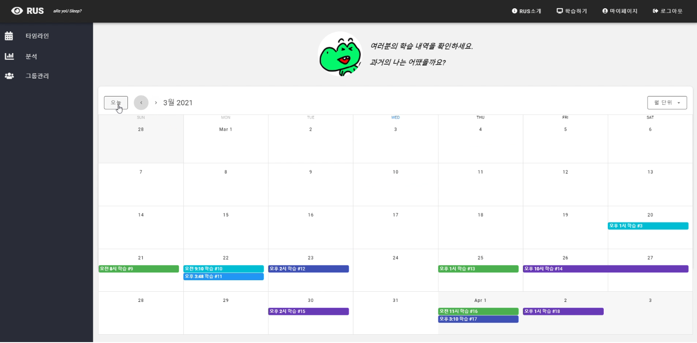
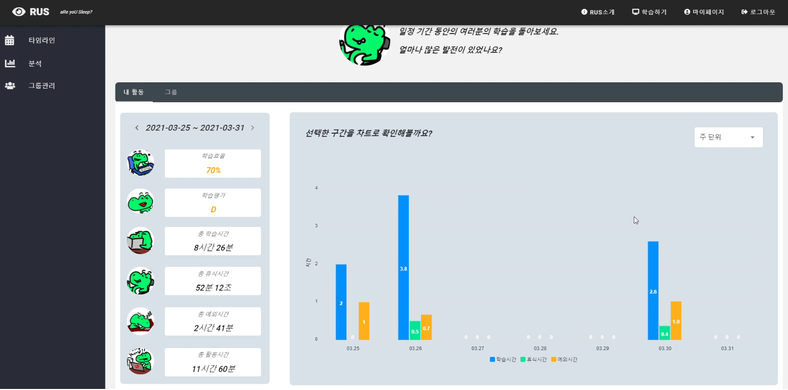
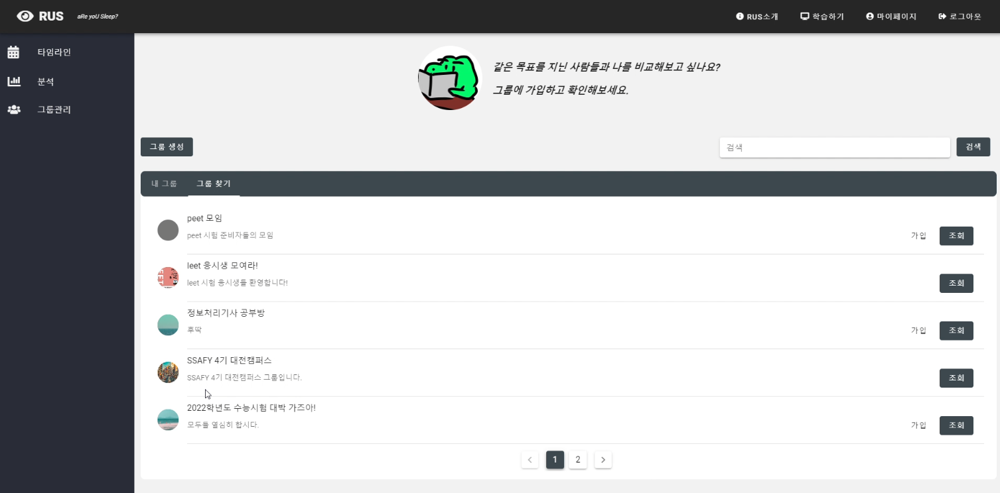

# RUS

:tv:**UCC** - [링크](https://www.youtube.com/watch?v=hAPnCE1Zpto)

## 프로젝트 요약

> **영상 분석 기반 학습 관리 서비스**
>
> RUS는 실시간 영상 분석을 통해 학습을 감독하며,
>
> 분석 서비스를 통해 개인의 학습 의지를 돕기 위한 서비스입니다.
>
> **서비스명** : **RUS**(러스) - a**R**e yo**U** **S**leeping?
>
> **비서명** : **Johnny**(쟈니)

<br/>

# 프로젝트 정보

## Install & Run

### :peach: AI models download

- [Download](https://drive.google.com/drive/folders/1LgkEJiu0MPgQ9oCXMuU5hbs9EWe2Oj2G?usp=sharing)
- 위 페이지에서 motion.h5, eyes.h5, shape_predictor_68_face_landmarks.dat 파일들과  yolo4-416 폴더 다운 받으셔서, `backend/ais` 내부에 넣으시면 됩니다.

### :apple: backend

```bash
$ git clone https://github.com/dongjay00/RUS.git
$ cd backend
$ python -m venv venv
$ source venv/Scripts/activate
$ pip install -r requirements.txt
$ python manage.py runserver
```

### :melon: frontend

```bash
$ git clone https://lab.ssafy.com/s04-ai-image-sub3/s04p23b102.git
$ cd rus-front
$ npm install
$ npm run serve
```


## [Documentation](https://www.notion.so/SSAFY-AI-B201-a1c94f9f0f9840c094d202e7888b33d1)

프로젝트 회의록 및 정리 문서입니다.


## Tech Stack



- **AI-model** : _YOLO4_, _Google Teachable Machine_ 


<br/>

# 화면

|                             메인                             |                           타임라인                           |
| :----------------------------------------------------------: | :----------------------------------------------------------: |
|  |  |
|                           **분석**                           |                           **그룹**                           |
|  |  |

<br/>

# 기능 소개

- 실시간 영상 식별
    - 실시간 영상 촬영을 통해 `집중`, `휴식`, `졸음`, `자리비움`, `딴짓`을 식별.
- 타이머 조작을 통한 학습 기록
    - `기록시작`부터 `기록종료`까지 식별한 모든 학습상태를 기록한다.
    - 각 상태의 시작, 종료 시간을 기록하여 기록이 종료되었을 시 한 번에 DB에 등록된다.
    - 휴식은 타이머 일시정지/해제를 통한 수동기록, 다른 상태는 타이머 작동 기간동안 자동기록.
- 학습 보조 (경고 알림, 카카오 메시지(진행중))
    - 졸음, 딴짓 상태가 일정시간 이상 지속됐을 시 화면에 **경고메시지 및 알림음 출현**. (**기준시간: 30초**)
    - 자리비움 상태가 일정시간 이상 지속됐을 시 회원 카카오 아이디로 개인메시지 전송. (**기준시간: 60초**)
- 과거 기록 분석
    - `타임라인`에서 과거 학습 기록 및 상세 정보를 확인 가능.
    - `분석` -> `내 활동`에서 특정 기간 동안 개인 활동 분석 결과 및 평가 확인 가능. 
- 그룹 분석
    - `그룹관리`에서 학습기록을 비교하고픈 그룹 생성, 가입, 조회, 탈퇴가 가능.
    - `분석` -> `그룹`에서 회원이 가입한 그룹과의 활동 비교 가능. 


## AI 모델 소개
> RUS 서비스에서 사용된 모델은 크게 사물인식 및 동작 & 안면인식으로 구분된다.

### 사물인식
- 사람이 있는지 감지를 하여 자리비움 여부, 핸드폰을 만지고 있는지 여부 판단.

- 사물인식의 경우 **YOLO4**를 이용하여 학습된 모델을 찾아 가져와서 활용.

### 동작 & 안면인식
- 졸음, 집중, 딴짓의 여부를 동작 이미지를 통한 학습 모델로 판별 이때 눈을 감았는지 판별하는 보조 모델을 이용하여 동작이 졸음이 아니더라도 눈을 감고 있으면 졸음으로 판별.

- 동작인식은 **구글 teachable machine**을 활용하여 학습을 시킴.

- 눈을 감고 있는지 판별하는 모델은 왼쪽눈에 대한 데이터 셋을 활용하여 학습을 시킴.

### 동작원리
- 1단계 사물인식 => 2단계 동작 & 안면인식 순서로 판별
- 1단계 모델은 사람, 핸드폰이 현재 이미지 상에 존재하고 있는지만 판별
- 1단계에서 자리비움이나 핸드폰이 감지되면 2단계 모델값 여부는 상관 하지 않고 상태 값 반환
- 2단계 모델은 졸음, 집중, 딴짓 동작중 어떤 동작과 일치하는 비율이 가장 높은지를 반환


<br/>

# :family: Author

- **팀명** : 제잘제잘(제발 잘하자 제대로 잘하자)
- **참여자**
  - 팀장 : 이동훈
  - 팀원 : 구진범, 노천명, 박승범, 조우리
- **역할 분담**
  - **Frontend** : 노천명, 조우리
  - **Backend & AI model** : 구진범, 박승범, 이동훈
  - **UCC** : 박승범